# GitHub Pages

This is a basic introduction to using GitHub in its basic form and creating GitHub Pages. Normally web developers would use the Commandline (CL) to push and pull changes to a remote server.

You can create GitHub pages which work as websites. To set up a GitHub Page you will need to register on [GitHub](https://github.com/) which is free.

From the overview page click on Repositories

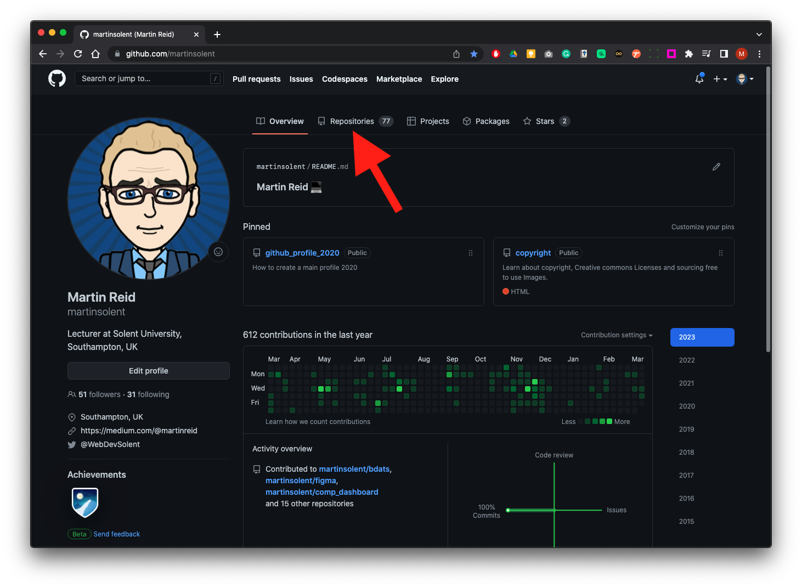

Once you are on the Repositories page click on New

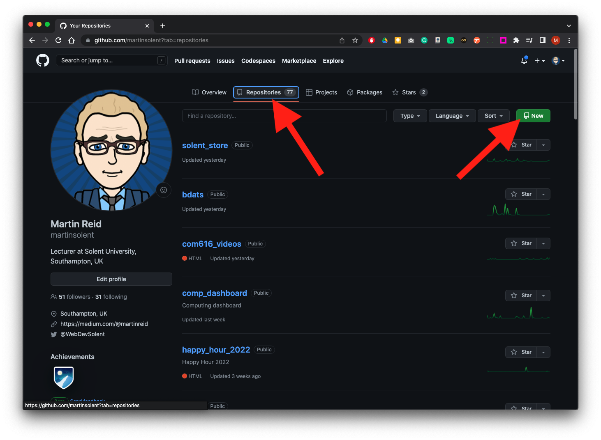

Type in a name for your page, make sure the page is public and check Add a README

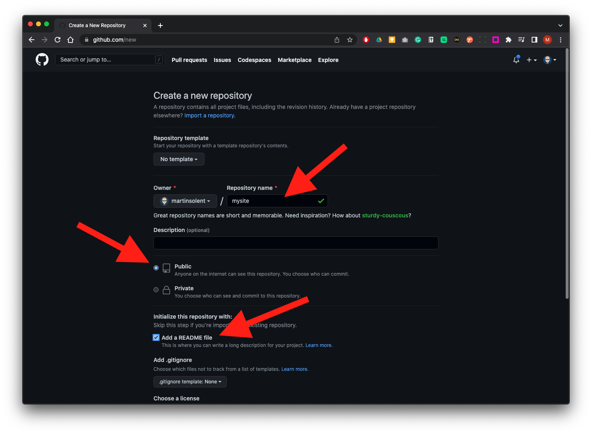

Scroll down to the bottom of the page and click the create Repository Button

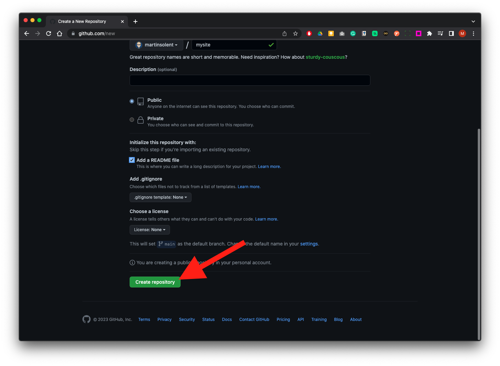

Now click on the pen tool to edit.

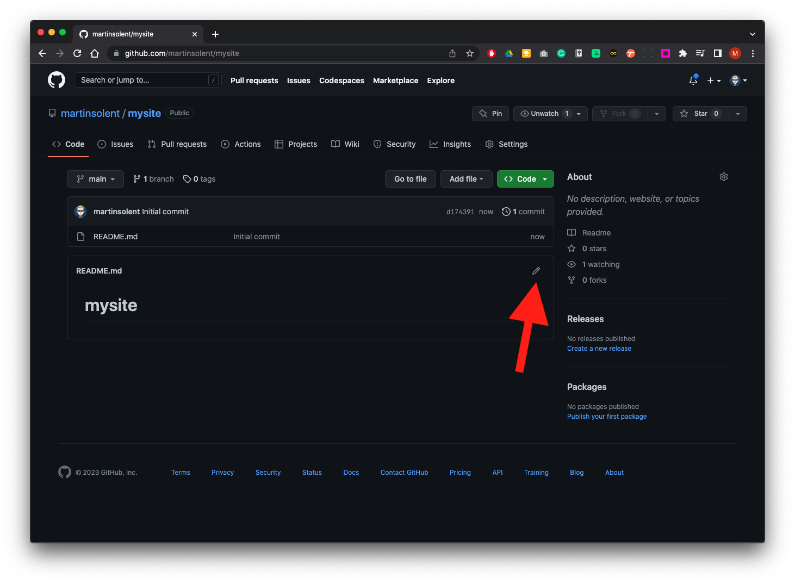

The page title will be the same as the name you called your repository we need to change that the hash symbol means this heading is heading 1 (h1) this is [Markdown ](https://github.com/adam-p/markdown-here/wiki/Markdown-Cheatsheet)script more information can be found here

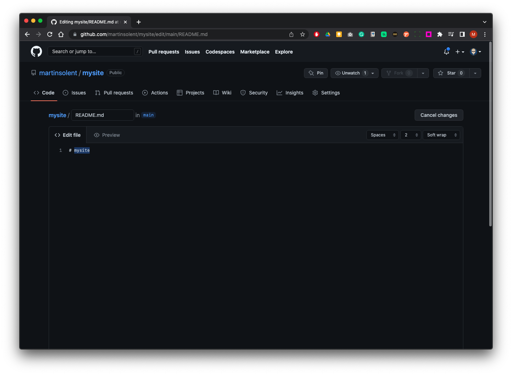

You can update the H1 Heading and also add some body text.

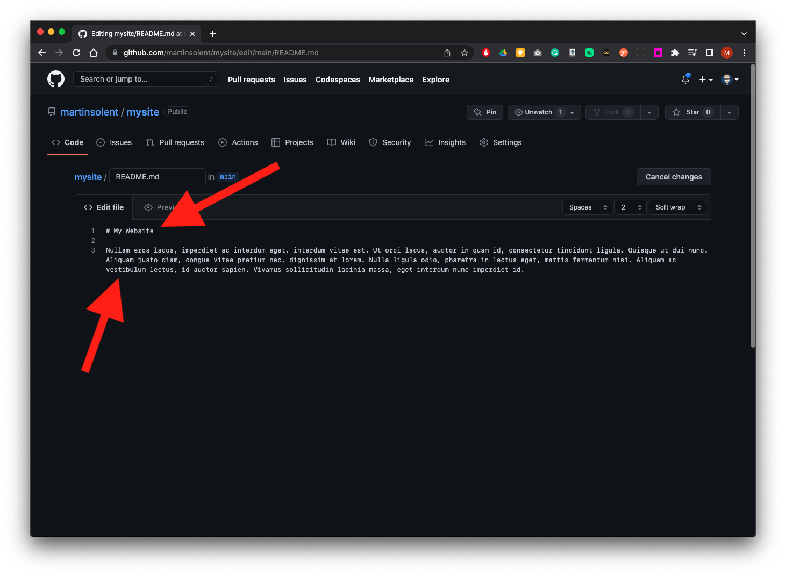

Click on Preview - then click on Commit Changes

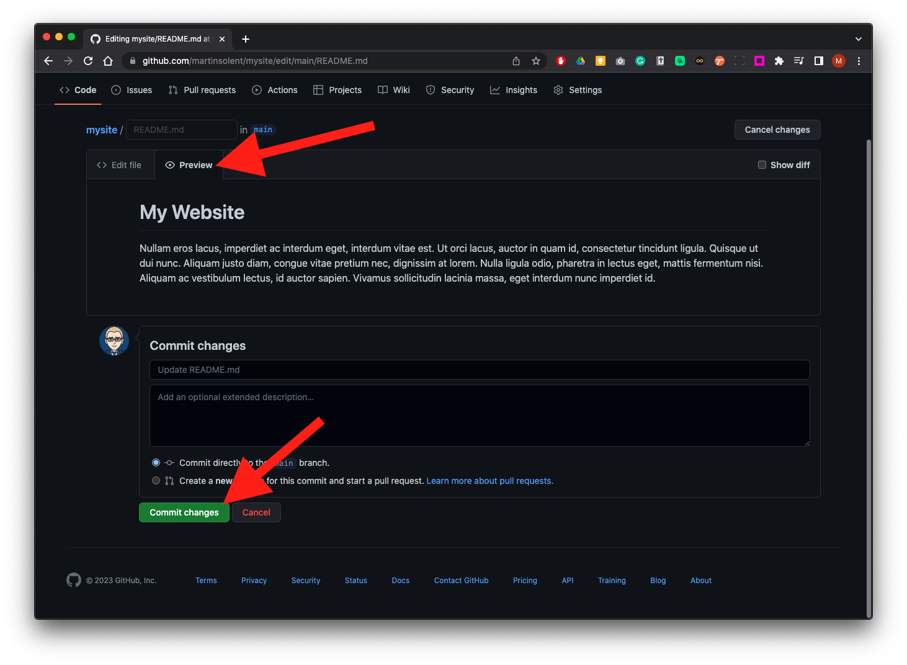

Click on mysite title to return to the main repository.

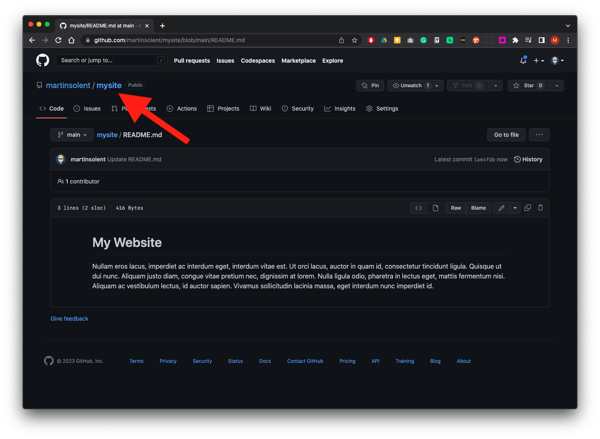

Now click on Settings

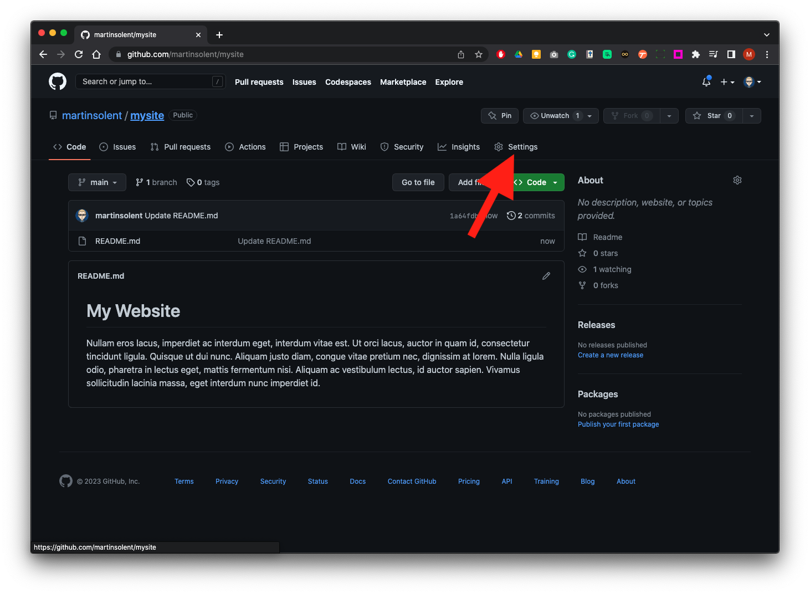

Then click on pages from the left panel.

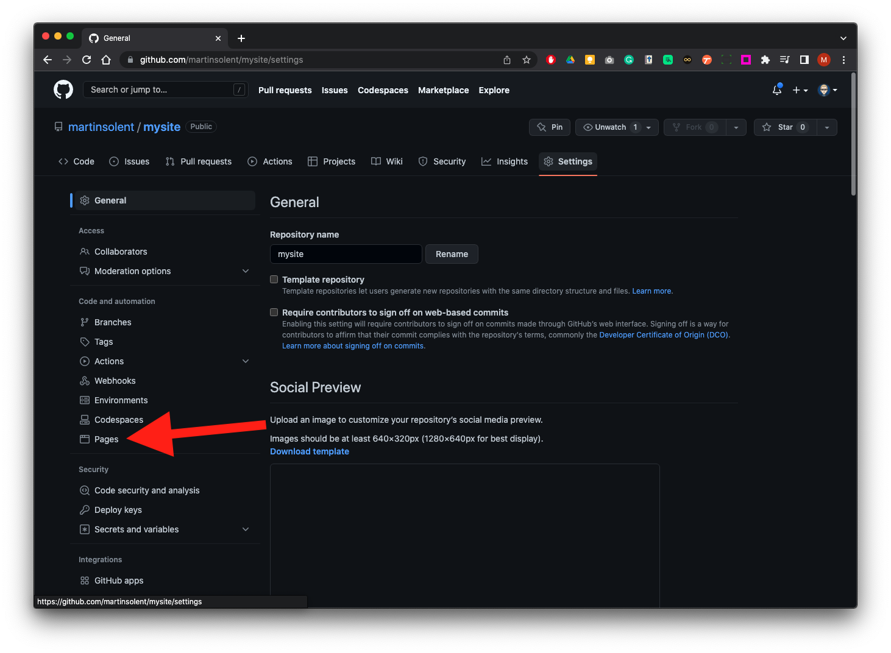

In the branch section

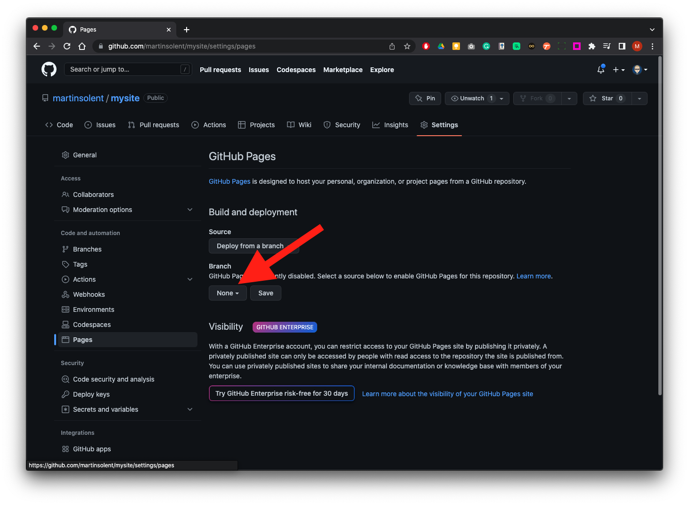

Change none...

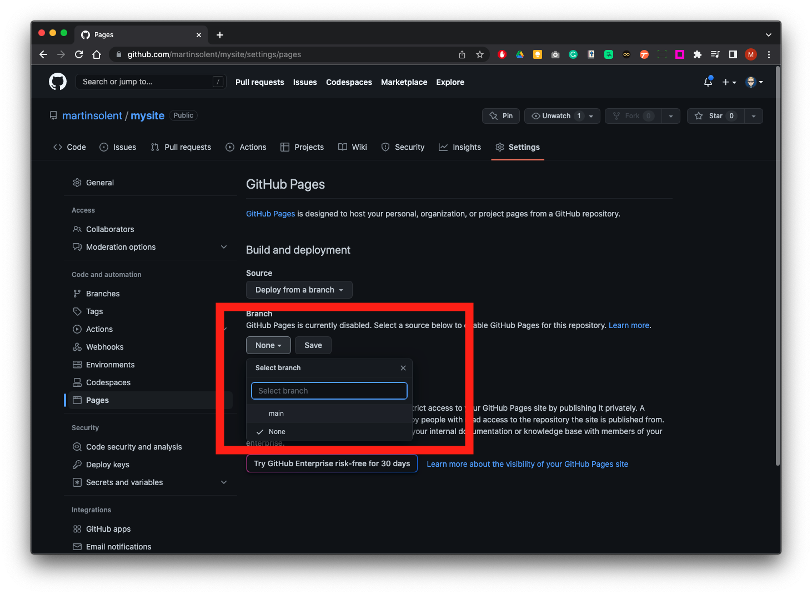

...to main

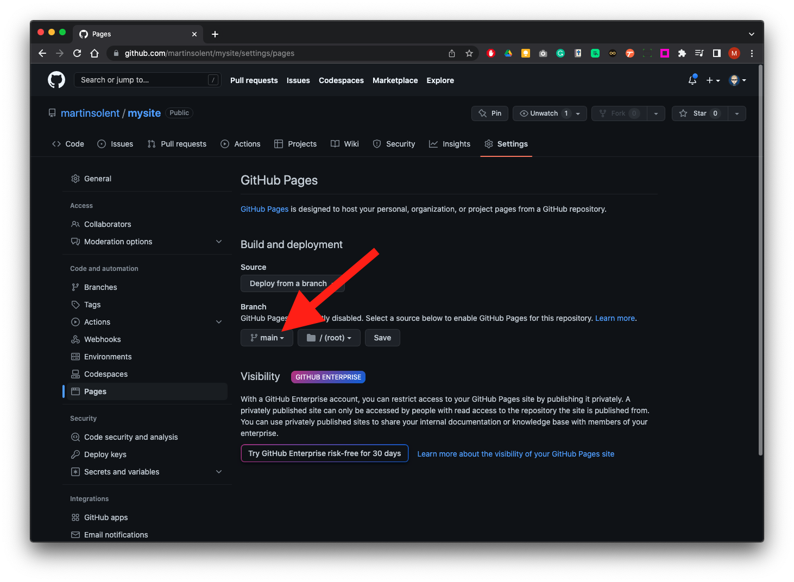

Click on the main site title to return to the main repository. Click on settings, click on pages from the last panel to discover the URL (web address of your site)

Go back to the main repository by clicking on the repository name. In the about section top left click on the cog and add a description. Then check use get on pages website this will populate the field with the URL of your GitHub page Save changes.

We now will add an image, here we have it on the desktop, we will drag and drop it to the repository page in the browser and it will add the file. We will add the commit name as add car image and click the Commit Changes button.

Click on the pen icon to edit underneath the block of text type:

``

`[ ]` = alternate text for the image

Commit Changes

You can check Actions to see how your page is being Built and Deployed, this may take some time, but you will give you an indication of its progress. Then go to the main repo by clicking on its title, then you can click the URL to check in the About section to your GitHub Page - it will be fully responsive.

## HTML Bootstrap Template

Now try this with a FREE HTML Bootstrap Template:[startbootstrap.com](https://startbootstrap.com/)

1. Download and unzip 
1. Create a new GitHub Rep
1. Drag drop files and Commit Changes
1. Create a GitHub Page

You can now edit and update html and CSS files

